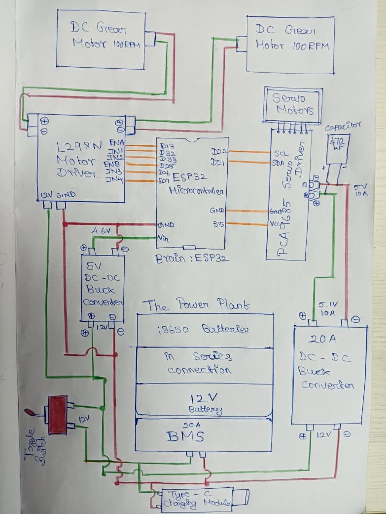
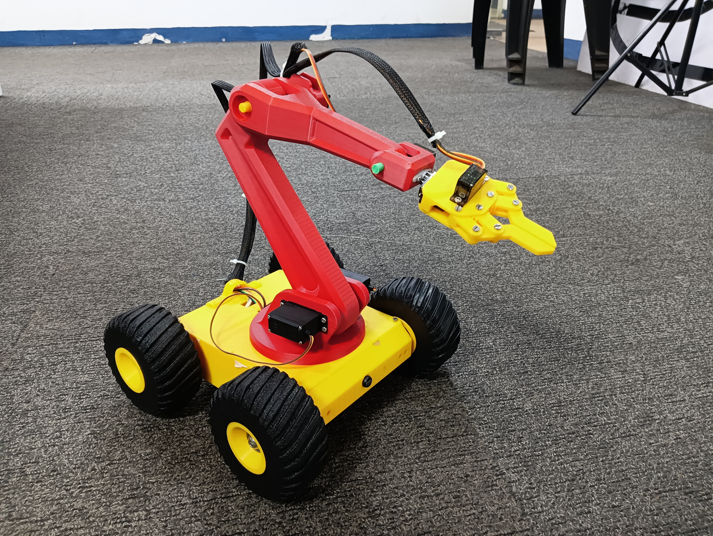
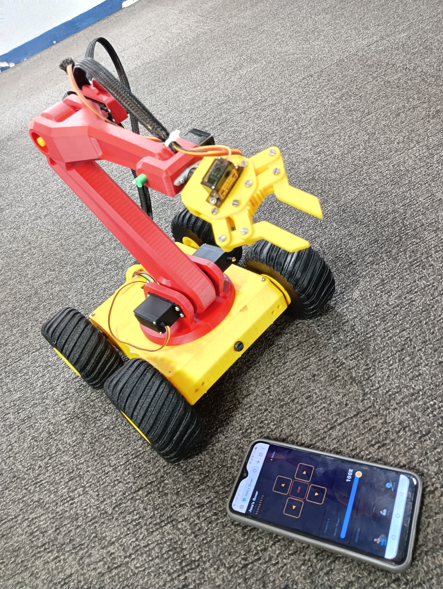

# Mobile-Controlled Rover with Robotic Arm

## Overview
This project is a custom-built rover controlled entirely via a local web interface. It integrates multiple motors and servos for complex movements, utilizing a local Wi-Fi network for real-time manual control and monitoring.

## Hardware Components
* **Microcontroller:** ESP32
* **Motor Driver:** L298N (for DC gear motors)
* **PWM/Servo Driver:** PCA9685 (for servo control)
* **Power Supply:** 12V Power supply with rechargeable C-Type port, using a 5V Buck converter, and a 20A buck converter for ESP32 and PCA muscle power.
* **Actuators:** DC Motors, Micro Servos

## Features
* **Web Interface:** Custom-built HTML/CSS control page hosted directly on the ESP32.

## Media & Schematics
### Circuit Diagram

### Project Images

